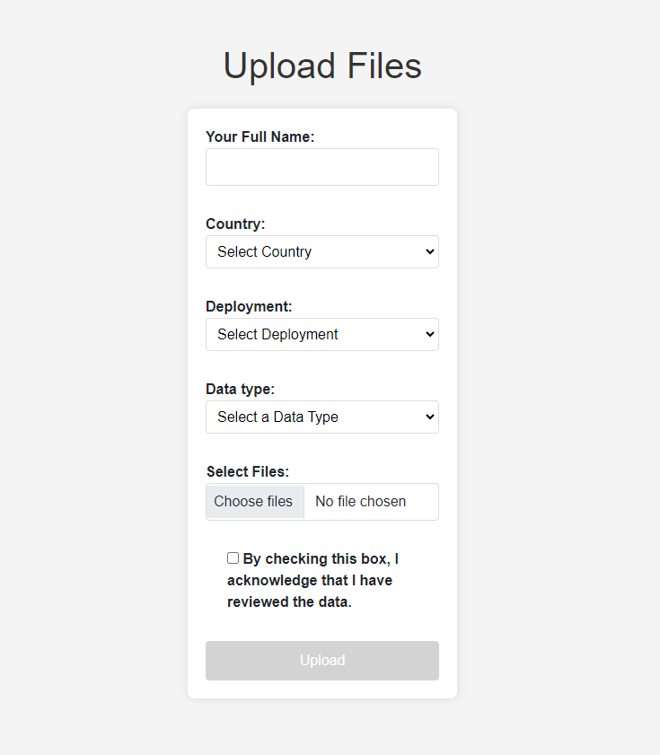

# LepiSense Input API

This project contains code for an API which provides a way to input data
generated by the LepiSense system. It is written in Python using the FastAPI
framework. Use it to upload images and manage deployment information.

It is created as a serverless application to be hosted on Amazon Web Services
(AWS) that you can deploy with the Serverless Application Model (SAM) Command
Line Interface (CLI).

The application uses several AWS resources, including Lambda functions and an
API Gateway API. These resources are defined in the `template.yaml` file in this
project. You can update the template to add AWS resources through the same
deployment process that updates your application code.


## Development

VS Code with the [AWS
Toolkit](https://docs.aws.amazon.com/toolkit-for-vscode/latest/userguide/welcome.html)
extension has been used to develop the code. The AWS Toolkit uses the SAM CLI to
build and deploy serverless applications on AWS. The AWS Toolkit also adds local
debugging for Lambda function code. See the following links to get started.

To use the SAM CLI, you need the following tools.

* SAM CLI - [Install the SAM CLI](https://docs.aws.amazon.com/serverless-application-model/latest/developerguide/serverless-sam-cli-install.html)
* [Python 3 installed](https://www.python.org/downloads/)
* Docker - [Install Docker community edition](https://hub.docker.com/search/?type=edition&offering=community)

I think the AWS CLI is installed with the toolkit

Build your application with the `sam build --use-container` command.

The SAM CLI installs dependencies defined in `app/requirements.txt`, creates a
deployment package, and saves it in the `.aws-sam/build` folder.

Use the `sam local start-api` to run the API locally on port 3000.

```bash
sam local start-api
curl http://localhost:3000/
```
  
## Database Setup

The Relational Database Service (RDS) has been chosen to provide a managed
PostgreSQL instance for data storage. Using a managed service reduces our
maintenance burden. Postgres offers flexibility and familiarity.

For initial development, a PostgreSQL database has been created using the
[RDS Console](console.aws.amazon.com/rds/home).

For the Lambda function to use the standard Python psycopg module for accessing
the database it has to be installed with the appropriate client libraries as 
they are not included in the operating system. For development,this has been
achieved by adding options in the requirements.txt

For the Lambda function to be able to connect to the database it has to attach
to the same Virtual Private Cloud (VPC) that hosts the database. As well as
specifying the VPC, subnets, and security group to use, permission has to be
given to allow Lambda to make the connection. This has been arranged in the SAM
template.yaml but it hard-codes VPC, subnet and security group values which
would be different in another installation. See
https://docs.aws.amazon.com/lambda/latest/dg/configuration-vpc.html
Broader use of CloudFormation or Terraform would help solve this. 

### Database Migrations

Alembic is installed for database migrations. The implementation is a bit odd
as there is no access to the database except via the lambda function and the 
API it provides.

First make any changes that are needed to app.sqlmodels and deploy the update.
Use the `/database/revision` endpoint to then cause alembic to autogenerate a
revision file. Paste this in to the alembic/versions folder with a file name 
in the format `<date as yyyymmdd>-<time as hhmm>-<revision id>-<description>.py`

Rebuild and redeploy the function then use the `/database/upgrade` endpoint to 
cause the database to be updated.

On first run, with a new database, to ensure Alembic is in step with the 
version of the database created by FastAPI/SqlModel, use the `database/stamp`
endpoint.

## Environment Variables

In the [Lambda Console](console.aws.amazon.com/lambda/home), add the following
environment variables.

For connection to the database, supply values obtatined from the RDS console.
- POSTGRES_HOST: lepisense.c14qc2uwid2u.eu-west-2.rds.amazonaws.com
- POSTGRES_PORT: 5432
- POSTGRES_USER: postgres
- POSTGRES_PASSWORD: a password
- POSTGRES_DB: lepisense

In addition, add values for an initial user having root access to the API. 
- INITIAL_USER_NAME: a username, e.g. userone
- INITIAL_USER_PASS: a mighty password
- INITIAL_USER_EMAIL: an email address

Add the following environment variables to support authentication:
- JWT_KEY = a key obtained with `openssl rand -hex 32`
- JWT_ALGORITHM = 'HS256'
- JWT_EXPIRES_MINUTES = '15'

Add a switch to select the environment from [dev|test|prod]. Defaults to prod.
- ENVIRONMENT = 'dev'

Add a switch to selct the log level from [debug|info|warning|error|critical].
Defaults to warning.
- LOG_LEVEL = 'info'

## Storage Setup

The Simple Storage Service (S3) is used for storing images sent to this API.

A storage bucket has been created with the 
[S3 Console](console.aws.amazon.com/s3/home)

The bucket is named `lepisense-images-<environment>` where environment is
replaced by the value of the environment variable of that name.

## Deployment

To be able to deploy to AWS you need to be suitably authenticated. You can do
this using the [AWS Command Line
Inerface](https://docs.aws.amazon.com/cli/latest/userguide/cli-chap-welcome.html)

First [sign in](https://docs.aws.amazon.com/signin/latest/userguide/command-line-sign-in.html).
to your AWS account. If it is the first time you will want to

```
aws configure sso
```

otherwise it is as follows, where you substitute `<your-profile-name>` with the
value you chose during the previous configuration.

```bash
aws sso login --profile <your-profile-name>
```

To build and deploy your application, run the following in your shell:

```bash
sam build --use-container
sam deploy --profile <your-profile-name> --config-env <dev|staging|prod>
```

The first command will build the source of your application. The second command
will package and deploy your application to AWS. Replace `<dev|staging|prod>`
with one of the three values according to the stage of deployment.

You can find your API Gateway Endpoint URL in the output values displayed after
deployment.


<!-- 

ORIGINAL DOCS FOLLOW - NOW OBSOLETE

## Using the Upload Page

### Accessing the Upload Page
Once the application is running, open your web browser and navigate to http://localhost:8080/. You will see a form that allows you to upload files.


### Uploading Files
1. **Fill in the form::** 
   - **Your Full Name:** Enter your full name.
   - **Country:** Select the country from the dropdown menu.
   - **Deployment:** Select the deployment from the dropdown menu.
   - **Data type:** Select the type of data (e.g., motion images, snapshot images, audible recordings, ultrasound recordings).
   - **Select Zip File:** Choose the zip file you want to upload, that contains images or audio files depending on the type of data that you are uploading.
   - **Review Data:** Check the box to acknowledge that you have reviewed the data.
  
  
2. **Upload the files::**
   - Click the ```Upload``` button to start the upload process.
   - A spinner will appear, and an alert will notify you not to close or refresh the page while uploading.
   - Once the upload is complete, a success message will be displayed. 
  
  
## Endpoints

### Documentation
- **Swagger UI:** [http://localhost:8080/docs](http://localhost:8080/docs)
- **ReDoc:** [http://localhost:8080/redoc](http://localhost:8080/redoc)


### Data management
- **Upload Data:** Endpoint for pushing images and audio files to the server. The files need to be compressed in zip folder not bigger than 5Gbs. 
  ```http
  POST /upload/
  ```
  Form Data:
  - `name`: `string`
  - `country`: `string`
  - `deployment`: `string`
  - `data_type`: `string`
  - `file`: `.zip file`
  

### Deployments
- **Get Deployments:** Endpoint to retrieve all deployment information.
  ```http
  GET /get-deployments/
  ```

- **Create Deployment:** Endpoint to create a new deployment. 
  ```http
  POST /create-deployment/
  ```
  Body (JSON):
  ```json
  {
    "country": "Country Name",
    "country_code": "Country Code",
    "location_name": "Location Name",
    "lat": "Latitude",
    "lon": "Longitude",
    "camera_id": "Camera ID",
    "hardware_id": "Hardware ID",
    "status": "inactive"
  }
  ```
  
  
- **Update Deployment:** Endpoint to update a deployment information. 
  ```http
  PUT /update-deployment/
  ```
  Body (JSON):
  ```json
  {
    "country": "Country Name",
    "country_code": "Country Code",
    "location_name": "Location Name",
    "lat": "Latitude",
    "lon": "Longitude",
    "location_id": "Location ID",
    "camera_id": "Camera ID",
    "system_id": "System ID",
    "hardware_id": "Hardware ID",
    "deployment_id": "Deployment ID",
    "status": "inactive"
  }
  ```
  
  
### Other Operations
- **List Data:** Endpoint for retrieving the list of files available for a particular deployment. 
  ```http
  GET /list-data/
  ```
  Query Parameters:
  - `country_location_name`: `string` (format: "Country - Location Name")
  - `data_type`: `string` (one of "motion_images", "snapshot_images", "audible_recordings", "ultrasound_recordings")
  
  
- **Get Logs:** Endpoint for downloading the logs from a bucket in the S3 server. 
Everytime a user push some new data to the server, the log file is update with some information: 
date and time, username, country, deployment, data type and filename. 
  ```http
  GET /get-logs/
  ```
  Query Parameters:
  - `country_location_name`: `string` (format: "Country - Location Name")
  - `data_type`: `string` (one of "motion_images", "snapshot_images", "audible_recordings", "ultrasound_recordings")
  
  
- **Create Bucket:** Endpoint to create a new bucket in the S3 server. In our case, bucket are countries. 
  ```http
  POST /create-bucket/
  ```
  Body (JSON):
  ```json
  {
    "bucket_name": "your_bucket_name"
  }
  ```
  

## License
This project is licensed under the Apache 2.0 License.


## Contact
For more information, visit [UKCEH AMI System](https://www.ceh.ac.uk/solutions/equipment/automated-monitoring-insects-trap) or contact the team at [ami-system@ceh.ac.uk](mailto:ami-system@ceh.ac.uk).
-->
