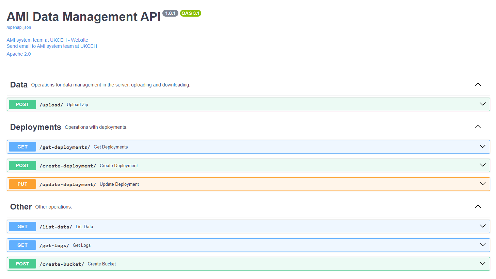

# AMI Data Management API

## Overview
This project provides an API to push data (images and audio files) into an S3 server. 
The API is built with FastAPI and includes endpoints for managing AMI system deployments and their data.

## Features
- Upload images and audio files to an S3 bucket.
- Manage deployment information.
- Automatically generated API documentation with Swagger UI and ReDoc.

## Installation

### Prerequisites
- Python 3.9+
- `conda` (optional, for creating a virtual environment)

### Steps

1. **Create a virtual environment:**
   ```sh
   conda create -n ami-api python=3.9
   conda activate ami-api
   ```

2. **Clone the repository:**
   ```sh
   git clone https://github.com/AMI-system/ami-api.git
   cd ami-api
   ```

3. **Install dependencies:**
   ```sh
   pip install -e .
   ```

4. **Create `credentials.json`:**
   Create a file named `credentials.json` in the root folder with the following content:
   ```json
   {
     "AWS_ACCESS_KEY_ID": "your_access_key_id",
     "AWS_SECRET_ACCESS_KEY": "your_secret_access_key",
     "AWS_REGION": "your_region",
     "AWS_URL_ENDPOINT": "your_endpoint"
   }
   ```

5. **Add `deployments_info.csv`:**
   Add the file named `deployments_info.csv` with the information about your AMI deployments.
   
## Running the Application locally
Start the application using Uvicorn:
```sh
uvicorn main:app --port 8080 --reload
```
  
  
## API Endpoints

### Documentation
- **Swagger UI:** [http://localhost:8080/docs](http://localhost:8080/docs)
- **ReDoc:** [http://localhost:8080/redoc](http://localhost:8080/redoc)



### Data management
- **Generate presigned url:** Endpoint for creating unique urls for pushing images and audio files to the server.  
  ```http
  POST /upload/
  ```
  Form Data:
  - `name`: `string`
  - `country`: `string`
  - `deployment`: `string`
  - `data_type`: `string`
  - `filename`: `string`
  - `file_type`: `string`

- **Upload Data:** Endpoint for pushing images and audio files to the server. The maximum number of files allowed each time is 1,000, to avoid crashing the server's memory. 
  ```http
  POST /upload/
  ```
  Form Data:
  - `name`: `string`
  - `country`: `string`
  - `deployment`: `string`
  - `data_type`: `string`
  - `files`: `files`

- **Ckeck if file exist:** Endpoint for checking if file already exists in the bucket.
  ```http
  POST /upload/
  ```
  Form Data:
  - `name`: `string`
  - `country`: `string`
  - `deployment`: `string`
  - `data_type`: `string`
  - `filename`: `string`
  

### Deployments
- **Get Deployments:** Endpoint to retrieve all deployment information.
  ```http
  GET /get-deployments/
  ```

- **Create Deployment:** Endpoint to create a new deployment. 
  ```http
  POST /create-deployment/
  ```
  Body (JSON):
  ```json
  {
    "country": "Country Name",
    "country_code": "Country Code",
    "location_name": "Location Name",
    "lat": "Latitude",
    "lon": "Longitude",
    "camera_id": "Camera ID",
    "hardware_id": "Hardware ID",
    "status": "inactive"
  }
  ```
  
  
- **Update Deployment:** Endpoint to update a deployment information. 
  ```http
  PUT /update-deployment/
  ```
  Body (JSON):
  ```json
  {
    "country": "Country Name",
    "country_code": "Country Code",
    "location_name": "Location Name",
    "lat": "Latitude",
    "lon": "Longitude",
    "location_id": "Location ID",
    "camera_id": "Camera ID",
    "system_id": "System ID",
    "hardware_id": "Hardware ID",
    "deployment_id": "Deployment ID",
    "status": "inactive"
  }
  ```
  
  
### Other Operations
- **List Data:** Endpoint for retrieving the list of files available for a particular deployment. 
  ```http
  GET /list-data/
  ```
  Query Parameters:
  - `country_location_name`: `string` (format: "Country - Location Name")
  - `data_type`: `string` (one of "motion_images", "snapshot_images", "audible_recordings", "ultrasound_recordings")
  
  
- **Get Logs:** Endpoint for downloading the logs from a bucket in the S3 server. 
Everytime a user push some new data to the server, the log file is update with some information: 
date and time, username, country, deployment, data type and filename. 
  ```http
  GET /get-logs/
  ```
  Query Parameters:
  - `country_location_name`: `string` (format: "Country - Location Name")
  - `data_type`: `string` (one of "motion_images", "snapshot_images", "audible_recordings", "ultrasound_recordings")
  
  
- **Create Bucket:** Endpoint to create a new bucket in the S3 server. In our case, bucket are countries. 
  ```http
  POST /create-bucket/
  ```
  Body (JSON):
  ```json
  {
    "bucket_name": "your_bucket_name"
  }
  ```


## Contributing
Feel free to fork this repository and create a pull request. For major changes, please open an issue first to discuss what you would like to change.


## License
This project is licensed under the Apache 2.0 License.


## Contact
For more information, visit [UKCEH AMI System](https://www.ceh.ac.uk/solutions/equipment/automated-monitoring-insects-trap) or contact the team at [ami-system@ceh.ac.uk](mailto:ami-system@ceh.ac.uk).
